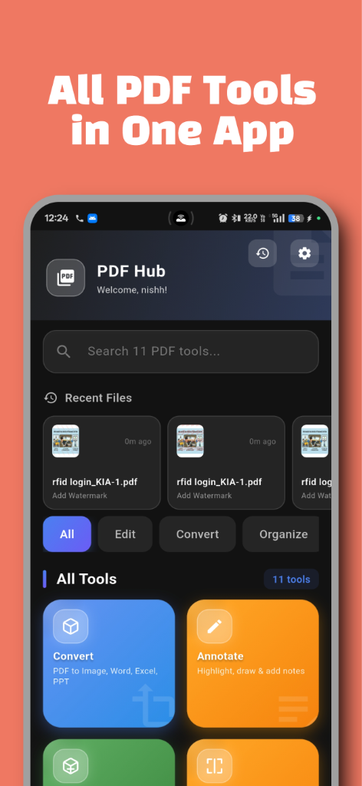
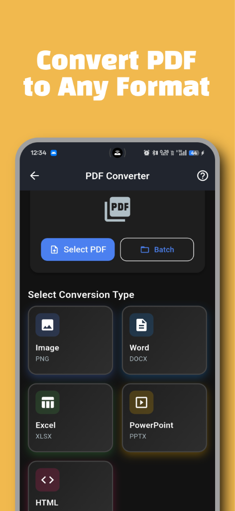
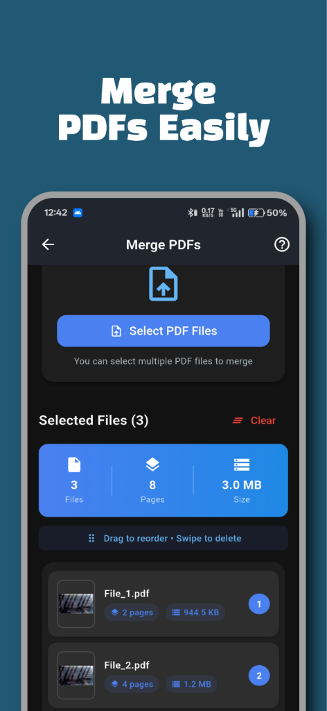
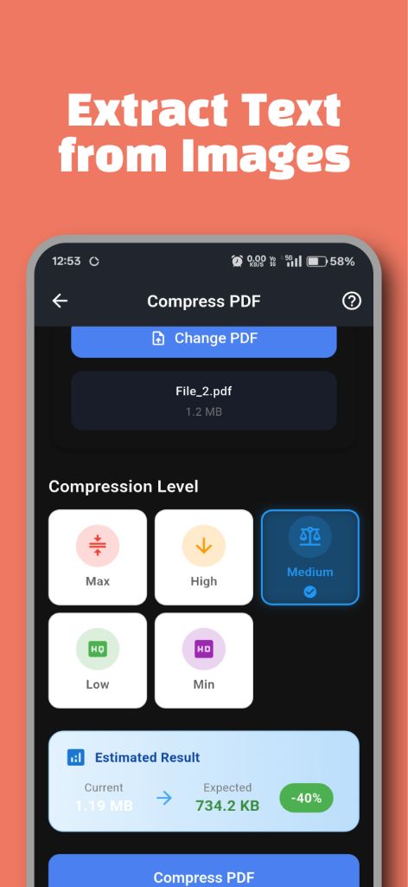
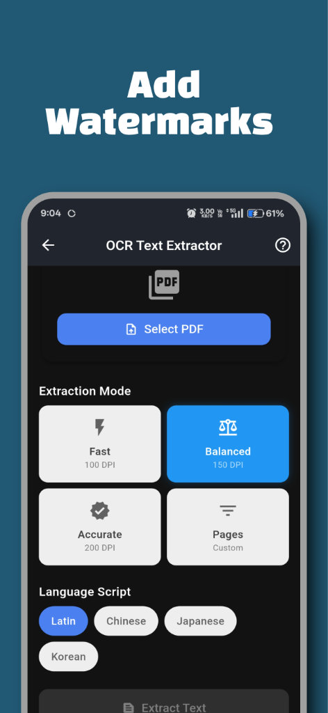
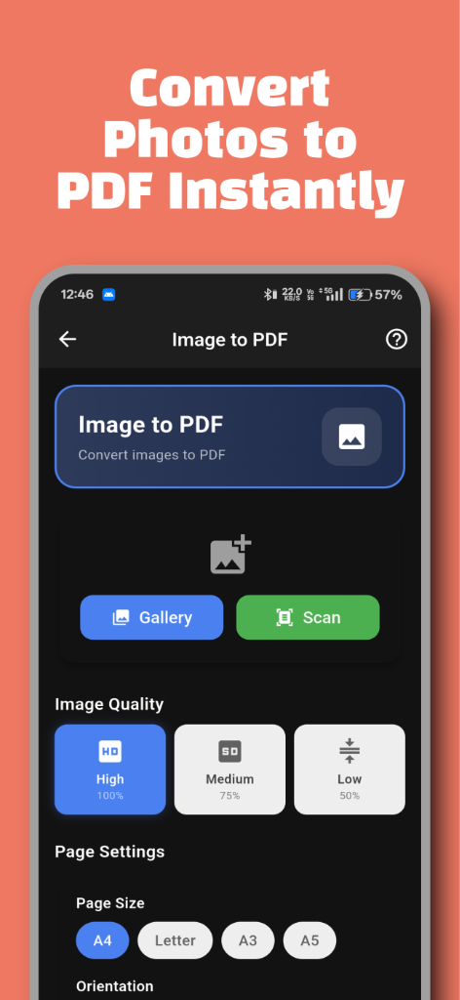
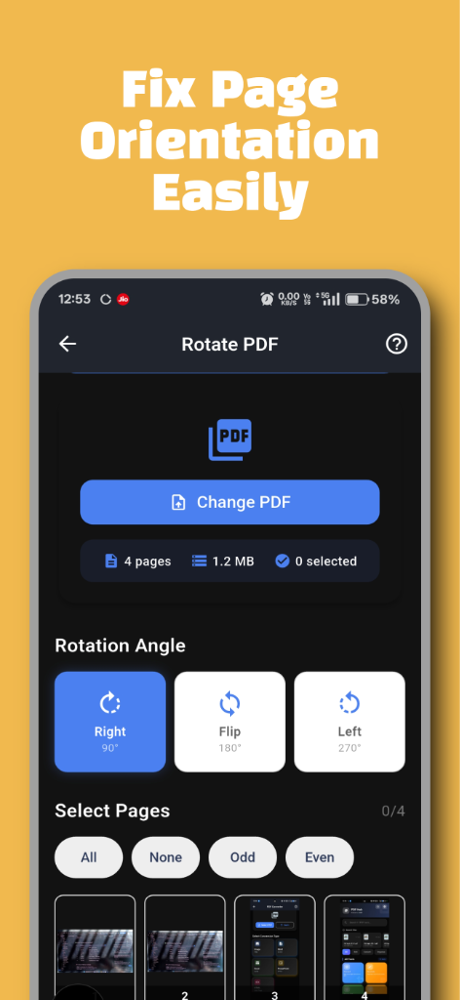

<div align="center">

# 📄 PDF Hub

**A Complete PDF Processing Toolkit for Android**

[](https://www.android.com)
[](https://flutter.dev)
[](https://dart.dev)
[](#license)


</div>

---

## 📑 Table of Contents

- [Project Overview](#-project-overview)
- [Problem Statement](#-problem-statement)
- [Solution](#-solution)
- [Tech Stack](#️-tech-stack)
- [Architecture](#️-architecture)
- [Performance Optimizations](#-performance-optimizations)
- [Screenshots](#-screenshots)
- [Getting Started](#-getting-started)
- [Play Store](#-play-store)
- [Disclaimer](#️-disclaimer)
- [Author](#-author)
- [License](#-license)

---

## 📋 Project Overview

PDF Hub is a feature-rich, offline-capable PDF processing application built with Flutter. It provides professional-grade PDF tools including OCR text extraction, document compression, merging, splitting, annotation, and format conversion — all within a beautiful, responsive UI.

### ✨ Key Features

| Feature | Description |
|---------|-------------|
| 📝 **OCR Text Extraction** | Extract text from scanned PDFs using Google ML Kit |
| 🗜️ **Smart Compression** | Reduce PDF file sizes while maintaining quality |
| 🔗 **Merge PDFs** | Combine multiple PDF documents into one |
| ✂️ **Split PDFs** | Extract specific pages from documents |
| 🎨 **Annotate** | Add highlights, drawings, text notes, and shapes |
| 🔄 **Rotate Pages** | Rotate individual or all pages |
| 🖼️ **Image to PDF** | Convert images to PDF documents |
| 💧 **Watermark** | Add text or image watermarks |
| 🔢 **Page Numbers** | Add customizable page numbering |
| 📊 **Convert Formats** | PDF to Image, Word, Excel, PowerPoint |

---

## 🎯 Problem Statement

Mobile users often need to process PDF documents on-the-go but face limitations:
- Most PDF apps require internet connectivity
- Free apps are cluttered with intrusive ads
- Premium features are locked behind expensive subscriptions
- Many apps have poor UI/UX on mobile devices

## 💡 Solution

PDF Hub addresses these challenges by providing:
- **Offline-first architecture** — All core features work without internet
- **Clean, intuitive UI** — Material Design 3 with dark/light mode support
- **Comprehensive toolset** — 10+ PDF tools in one app
- **Performance optimized** — Memory-efficient processing for mobile devices
- **Ad-supported free tier** — Full functionality with unobtrusive ads

---

## 🛠️ Tech Stack

| Category | Technologies |
|----------|--------------|
| **Framework** | Flutter 3.27, Dart 3.5 |
| **State Management** | Provider |
| **PDF Processing** | Syncfusion PDF, pdf, printing |
| **OCR Engine** | Google ML Kit Text Recognition |
| **Ads** | Google Mobile Ads |
| **In-App Purchases** | in_app_purchase |
| **File Handling** | file_picker, share_plus, path_provider |
| **UI Components** | flutter_svg, lottie, shimmer |

---

## 🏗️ Architecture

The project follows a **feature-first architecture** with clear separation of concerns:

```
lib/
├── core/               # Core utilities and constants
├── features/           # Feature modules (OCR, compress, merge, etc.)
│   ├── annotate/
│   ├── compress/
│   ├── convert/
│   ├── home/
│   ├── merge/
│   ├── ocr/
│   ├── rotate/
│   ├── split/
│   ├── watermark/
│   └── ...
├── models/             # Data models
├── screens/            # Shared screens (splash, settings, etc.)
├── services/           # Business logic and external integrations
│   ├── ad_service.dart
│   ├── pdf_ocr_service.dart
│   ├── pdf_merger_service.dart
│   └── ...
├── utils/              # Helper utilities
├── widgets/            # Reusable UI components
└── main.dart           # Application entry point
```

### Key Engineering Decisions

1. **Feature-First Structure**: Each feature is self-contained with its own screens, making the codebase scalable and maintainable.

2. **Service Layer Pattern**: All business logic is abstracted into services, enabling easy testing and modification.

3. **Memory-Optimized OCR**: Implemented page limits (max 5 pages), reduced DPI (120), and disabled image enhancement to prevent crashes on low-end devices.

4. **Graceful Degradation**: Non-Latin OCR scripts fallback to Latin if models fail to load.

5. **Responsive Design**: Uses `MediaQuery` and custom `ResponsiveUtils` for adaptive layouts across screen sizes.

---

## ⚡ Performance Optimizations

| Optimization | Implementation |
|--------------|----------------|
| **Memory Management** | Limited OCR to 5 pages max, reduced rendering DPI |
| **Crash Prevention** | Try-catch wrappers around ML Kit operations |
| **Ad Loading** | Preloaded banner and interstitial ads for faster display |
| **Theme Performance** | Cached theme calculations, avoided rebuilds |
| **Lazy Loading** | History and file lists use lazy loading |

---

## 📱 Screenshots

<div align="center">

| Home | Convert | Merge | Compress |
|:----:|:-------:|:-----:|:--------:|
|  |  |  |  |

| Watermark | OCR | Image to PDF | Rotate |
|:---------:|:---:|:------------:|:------:|
|  |  |  |  |

</div>

---

## 🚀 Getting Started

### Prerequisites

- Flutter SDK 3.27+
- Android Studio / VS Code
- Android SDK 21+

### Installation

```bash
# Clone the repository
git clone https://github.com/Nishanth619/PDF-Hub.git

# Navigate to project directory
cd PDF-Hub

# Install dependencies
flutter pub get

# Run the app
flutter run
```

### Environment Setup

Create a `.env` file in the root directory:

```env
BANNER_AD_ID=your_banner_ad_id
INTERSTITIAL_AD_ID=your_interstitial_ad_id
```

---

## 📦 Play Store

> **Status**: Currently in Closed Testing

The app will be available on Google Play Store soon.

---

## ⚠️ Disclaimer

This is a personal project created for educational and portfolio purposes. Some features use third-party libraries and services:
- PDF processing powered by Syncfusion Flutter PDF
- OCR powered by Google ML Kit
- UI icons from Material Design

---

## 👤 Author

**Nishanth Ardhya**

- GitHub: [@Nishanth619](https://github.com/Nishanth619)

---

## 📄 License

This project is proprietary software. All rights reserved.

**© 2026 Nishanth Ardhya. Unauthorized copying, modification, or distribution is prohibited.**

See [LICENSE](LICENSE) for more details.
